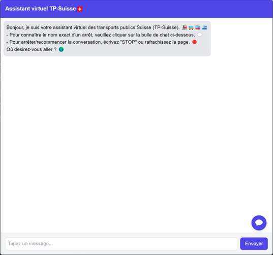
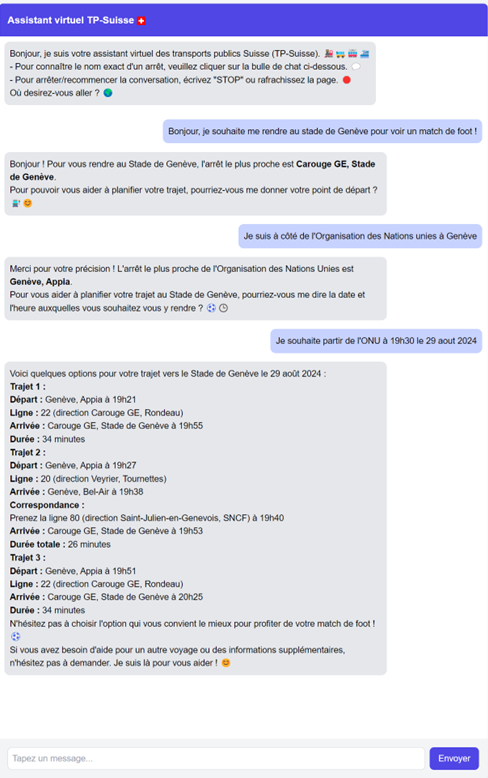
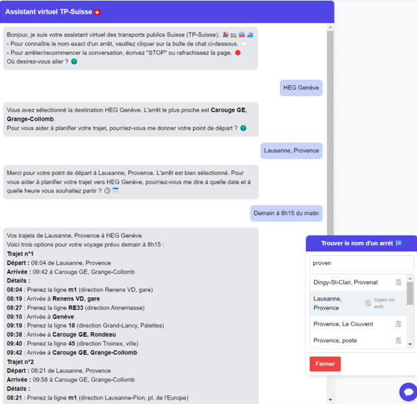

# Assistant Virtuel pour Planifier les Trajets en Transports Publics en Suisse

Ce projet a pour objectif de développer un assistant virtuel intelligent permettant de planifier des trajets en transports publics en Suisse. L'application combine des technologies avancées telles que le traitement du langage naturel (NLP) et une API de planification d'itinéraires, le tout déployé sur une interface utilisateur accessible et ergonomique.

## Table des matières

- [Fonctionnalités](#fonctionnalités)
- [Prérequis](#prérequis)
- [Installation](#installation)
- [Utilisation](#utilisation)
- [Aperçu du projet](#aperçu-du-projet)
- [Contribuer](#contribuer)
- [License](#license)

## Fonctionnalités

- Planification de trajets en transports publics.
- Interface utilisateur interactive.
- Chatbot utilisant GPT-4o-mini pour guider l'utilisateur.
- Documentation interactive accessible via `/docs` et `/redoc`.

## Prérequis

Avant de commencer, assurez-vous que les éléments suivants sont installés sur votre système :

- Docker
- Python 3.8+
- Git

## Installation

### Étape 1 : Cloner le projet

Clonez le dépôt GitHub dans le répertoire de votre choix :

```bash
git clone https://github.com/veton-berisha/assistant-transport-public-suisse.git
cd assistant-transport-public-suisse
```

### Étape 2 : Configuration de le la base de données MongoDB

Assurez-vous que Docker est en cours d'exécution, puis démarrez MongoDB en utilisant Docker Compose :
    
```bash
docker-compose up -d
```
Vous pouvez vérifier la connexion à MongoDB à l'aide de MongoDB Compass.

### Étape 3 : Configuration de l'environnement Python

Créez un environnement virtuel et installez les dépendances requises :

```bash
python -m venv venv
source venv/bin/activate # Pour Linux et MacOS
venv\Scripts\activate # Pour Windows

pip install -r requirements.txt
```

### Étape 4 : Exécuter le processus ETL

Lancez le processus ETL pour préparer les données nécessaires :

```bash
python etl/run_etl_process.py
```

### Étape 5 : Lancer l'application

Utiliser Uvicorn pour démarrer l'application FastAPI :

```bash
uvicorn app.main:app --reload
```
L'application sera accessible à l'adresse suivante : http://127.0.0.1:8000/.

## Utilisation

L'application est accessible via une interface utilisateur interactive. Vous pouvez également accéder à la documentation interactive via `/docs` et `/redoc`.

Après avoir démarré l'application, commencez une conversation avec le chatbot en indiquant simplement votre destination. Le chatbot vous guidera à travers les étapes suivantes : origine, date, et heure de départ pour planifier votre trajet.

Pour réinitialiser la conversation : 
- Tapez `STOP` dans le chatbot.
- Rafraîchissez la page.

## Aperçu du projet

Voici un aperçu de l'interface utilisateur de l'application :
<!-- dossier img : 4 images, TB_Image1.png, TB_Image2.png, TB_Image3.png, TB_Image4.png -->






## Contribuer

Le projet est ouvert aux contributions. N'hésitez pas à ouvrir une issue, à soumettre une pull request ou à me proposer des idées pour améliorer le projet.

## License

Ce projet est sous licence MIT. Pour plus d'informations, veuillez consulter le fichier [LICENSE](LICENSE).
